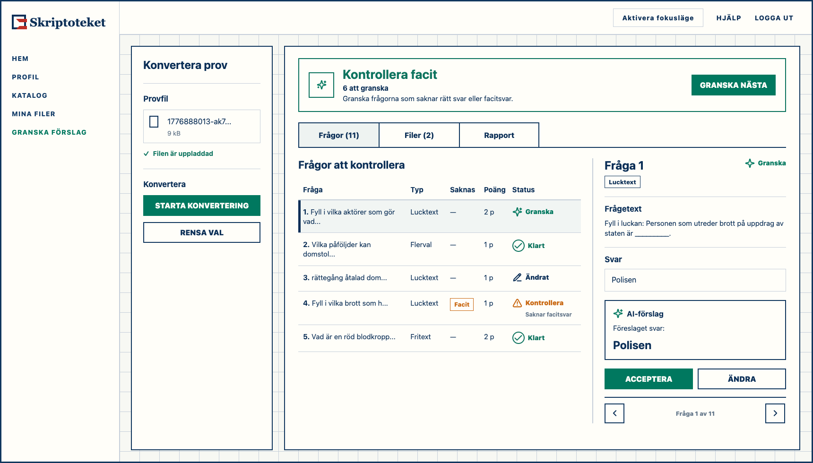
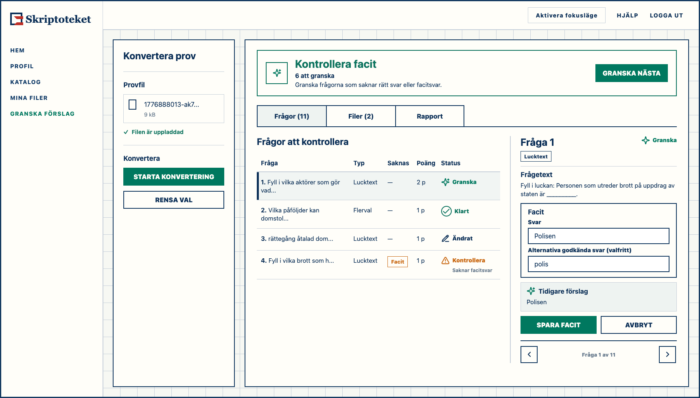
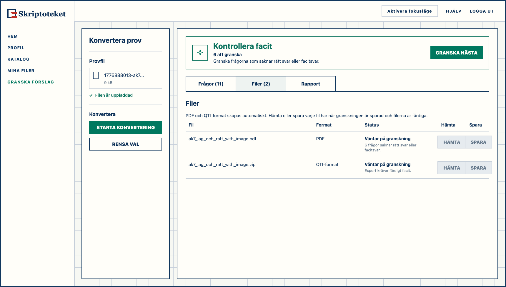
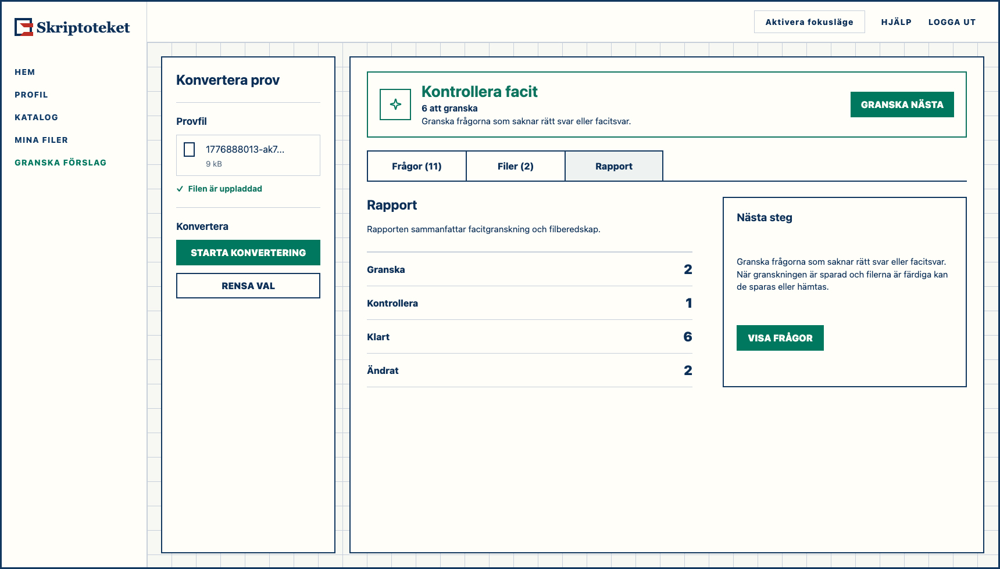

# PR-0406 Answer-Key Review Desktop Alignment

## Purpose

Retain the desktop Exam Converter alignment mockup for PR-0406 answer-key
review. This bundle applies the approved small-screen state, copy, and symbol
decisions to the desktop workbench rather than replacing the desktop workbench
with a stacked mobile flow.

This is decision material, not inspirational material. Until product approval
is recorded, its status remains `proposed`.

## Canonical Previews

The editable source for these previews is [`index.html`](index.html). Re-render
the PNGs with [`render.mjs`](render.mjs) if the approved copy or layout changes.

## Proposed Desktop Layout

- Desktop keeps the workbench advantage: left workflow rail, central question
  table, and one selected-question detail pane for `Frågor`.
- The workflow rail does not expose PDF/QTI target-file selection before
  conversion. PDF and QTI are produced automatically when supported; the
  teacher chooses whether to download or save each generated file in `Filer`
  after review persistence and export readiness are confirmed.
- `Filer` and `Rapport` are exclusive inspection modes on desktop as well.
  They must not carry selected-question detail or a singular question summary.
- The result band uses projection-backed review framing when compact review
  state exists: `Kontrollera facit`, a compact review count such as
  `6 att granska`, and
  `Granska frågorna som saknar rätt svar eller facitsvar.`
- `Konverteringen av provet lyckades delvis` is not the projection-backed
  review message.
- Export-ready copy remains gated by Sir Convert target readiness and replay
  artifact authority; the answer-key review projection alone does not unlock
  download or save actions.

## Proposed Copy And State Semantics

- Pending advisory: `Granska` with `IconAi` / `Sparkles`.
- Reviewed complete: `Klart` with checkmark only. No AI badge beside `Klart`.
- Teacher-owned modified key/content: `Ändrat` where orientation is useful,
  with no AI marker.
- Current validation issue: `Kontrollera` with a concrete missing-key reason.
- Missing multiple-choice key: `Inget rätt svar valt`.
- Missing multi-answer key: `Välj minst ett rätt svar`.
- Missing gap/open-cloze value: `Saknar facitsvar`.
- Manual selection, manual editing, and validation repair use `Spara facit`.
- `Acceptera` is only for accepting a pending AI suggestion unchanged.
- AI provenance is bounded detail only, for example `Tidigare förslag`; it does
  not drive list state, completion, or file readiness.
- `Ändra` opens the normal answer-key editing surface in the selected-question
  detail pane. It does not open a separate AI workflow, modal, or export step.

## Desktop Navigation Behavior

- The selected-question detail pane has sticky symbolic previous/next controls.
- Use Lucide `ChevronLeft` and `ChevronRight`, or approved wrappers for those
  local navigation controls.
- The controls use accessible labels and may use tooltips, but do not show
  persistent visible `Föregående` / `Nästa` text.
- `Acceptera` and `Spara facit` are persistence actions, not navigation
  actions.
- After `Acceptera` or valid `Spara facit`, the UI waits for
  backend-confirmed persistence/readback and fresh Sir Convert replay
  projection before auto-advancing to the next actionable item.
- Do not advance optimistically on click.

## Symbol Contract

All represented production symbols must resolve through the approved symbol
contract in
`docs/reference/ref-symbol-semantics-inventory-and-decision-contract-2026-05-04.md`.

| Mockup use | Semantic slot | Approved wrapper/component | Decision |
|---|---|---|---|
| Pending advisory and `AI-förslag` | AI feature or AI-assisted behavior | `IconAi` / `Sparkles` | Approved. Do not use `Bot`. |
| `Klart` and selected correct answer | Success/selected | `IconCheck` / `Check` | Approved. The circle is status-container chrome. |
| `Ändrat` | Edit existing answer-key content | `IconEdit` / `PencilLine` | Approved for teacher-owned modified content. |
| `Kontrollera` validation issue | Warning/risk state | `IconWarning` / `AlertTriangle` | Approved for current validation problems. |
| Detail previous item | Local previous navigation | `ChevronLeft` from Lucide proper | Local navigation control. Add a wrapper decision if production needs a shared wrapper. |
| Detail next item | Local next navigation | `ChevronRight` from Lucide proper | Local navigation control. Add a wrapper decision if production needs a shared wrapper. |
| File download | Download action | `IconDownload` / `Download` | Approved. |
| Save to files | Files/vault plus save action | `IconVaultFiles` / `FolderOpen` or local save wrapper if approved | Do not use download icon for save-to-vault. |

## Implementation Guardrails

- Do not expose internal enum names or long state-machine labels in the UI.
- Do not use error color for pending advisory suggestions.
- Do not preserve AI current-key markers after teacher-owned edits.
- Do not use direct feature-local `Bot`, `CheckCircle2`, or `XCircle` imports
  for PR-0406 review state.
- Do not expose PDF/QTI checkboxes or target-file/source-format choices before
  conversion. The source file determines source handling; generated export files
  are selected only in `Filer`.
- Do not infer file/export readiness from local drafts or list labels.
  Readiness comes from Sir Convert target readiness and replay artifact
  references.
- Treat this mockup as exact for the represented desktop decisions after
  product approval. If production constraints require a visual deviation,
  update this bundle before implementation.
