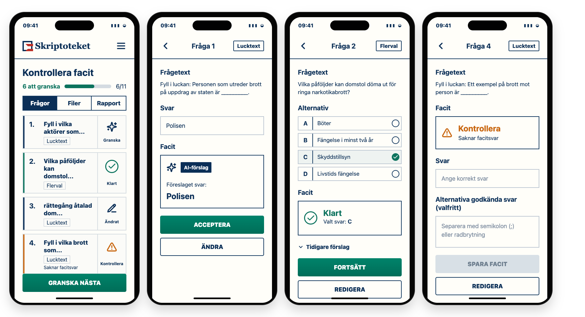

# PR-0406 Answer-Key Review Small-Screen Flow

## Purpose

Retain the approved small-screen decision mockup for Exam Converter answer-key
review. This is not inspirational material. It is the exact design decision for
the PR-0406 small-screen review states and copy.

## Canonical Preview

The editable source for this preview is [`index.html`](index.html). Re-render
the PNG with [`render.mjs`](render.mjs) if the approved copy or layout changes.

## Approved Layout

- Small screens use a bespoke task flow, not a squeezed or stacked desktop
  two-column workspace.
- The first screen is the question review list with compact state affordances,
  progress, and segmented navigation: `Frågor`, `Filer`, `Rapport`.
- Selecting a question opens a full-width item detail surface with a back
  affordance and the item type badge.
- `Filer` and `Rapport` are separate narrow-viewport surfaces; they are not
  represented as a selected-question editor beside a list.
- Row/card geometry must not clip labels, buttons, status icons, or Swedish
  copy at phone-sized viewports.

## Approved Copy And State Semantics

- Pending AI suggestion: `Granska` with `IconAi`/`Sparkles` affordance.
- Accepted AI suggestion unchanged: `Klart` with checkmark only. No AI badge is
  shown beside `Klart`.
- Teacher changed the suggested key or keyed content: teacher-owned state,
  shown as `Ändrat` where orientation is useful, with no AI marker.
- Current validation issue: `Kontrollera` with a concrete missing-key reason.
- Missing multiple-choice key: `Inget rätt svar valt`.
- Missing multi-answer key: `Välj minst ett rätt svar`.
- Missing gap/open-cloze value: `Saknar facitsvar`.
- Manual selection, manual editing, and validation repair use `Spara facit`.
- `Spara facit` is disabled until the teacher has supplied a valid key/value.
- `Acceptera` is only for accepting a pending AI suggestion unchanged.
- A second click on save/accept must not silently convert unchanged AI
  provenance into a teacher-authored key.
- AI provenance is bounded detail only, for example `Tidigare förslag`; it does
  not drive list state, completion, or file readiness.

## Symbol Contract

All represented production symbols must resolve through the approved symbol
contract in
`docs/reference/ref-symbol-semantics-inventory-and-decision-contract-2026-05-04.md`.

| Mockup use | Semantic slot | Approved wrapper/component | Decision |
|---|---|---|---|
| Pending AI suggestion and `AI-förslag` badge | AI feature or AI-assisted behavior | `IconAi` / `Sparkles` | Approved. Do not use `Bot` for this PR-0406 state. |
| `Klart` and selected correct answer | Success/selected | `IconCheck` / `Check` | Approved. The surrounding circle is status-container chrome, not a separate `CircleCheck` symbol. |
| `Ändrat` | Edit existing answer-key content | `IconEdit` / `PencilLine` | Approved. Use because the current key is teacher-owned modified content. |
| `Kontrollera` validation issue | Warning/risk state | `IconWarning` / `AlertTriangle` | Approved. Use for current validation problems such as missing key/value. |
| App shell menu | Small-screen navigation menu | `Menu` from Lucide proper | No existing approved global slot; Lucide inventory contains `Menu`. Implementation should use the existing shell's approved menu treatment or add a wrapper decision before changing shared shell semantics. |
| Return from detail to list | Local back navigation | `ChevronLeft` from Lucide proper | No existing approved global slot for this exact local back affordance. It is not `IconX`, because the action is navigation, not dismiss/delete. |
| `Tidigare förslag` disclosure | Disclosure state indicator | `ChevronDown` from Lucide proper | Local control indicator only, not a product semantic. |

## Implementation Guardrails

- Do not expose internal enum names or long state-machine labels in the UI.
- Do not use error color for pending AI suggestions; pending review is not an
  error.
- Do not preserve AI current-key markers after teacher-owned edits.
- Do not use direct feature-local `Bot`, `CheckCircle2`, or `XCircle` imports
  for PR-0406 review state. Route production symbols through the approved
  wrappers or add a governed symbol decision before introducing a new wrapper.
- Do not infer file/export readiness from local drafts or list labels.
  Readiness comes from Sir Convert replay projection and target artifacts.
- Treat this mockup as exact for the represented states and copy. If production
  constraints require a visual deviation, update this bundle before code
  implementation.
