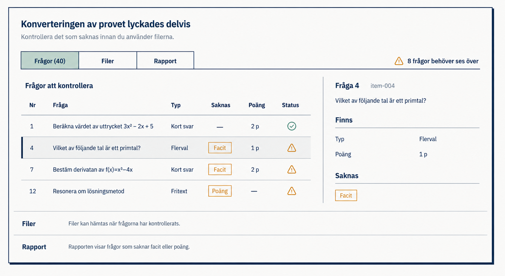
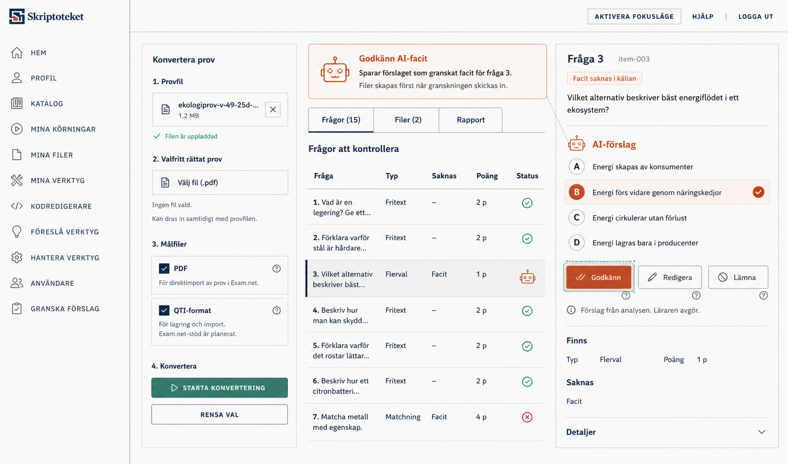

# ST-21-03 Exam Converter Authenticated Progressive Review

## Purpose

Retain the selected mockup direction for the authenticated Exam Converter
workspace before implementation continues under `PR-0325`.

This mockup is approved as a broad interpretation of Skriptoteket's
Klassrumskartan-derived design system: dense workspace, token-driven color,
hard structural lines, progressive disclosure, and teacher-facing Swedish copy.

## Preview

## PR-0326 AI-Facit Review Preview

Use this second preview as the accepted PR-0326 UI direction. It supersedes any
earlier AI-facit mockup that introduced a separate `Facit` table column or
duplicated service-state explanation in the grid.

## Design Verdict

Accepted:

- overall visual alignment with Skriptoteket and Klassrumskartan;
- top application bar, canvas tone, deep navy structure, and verdigris primary
  action treatment;
- left workflow rail as the persistent input/action surface;
- compact result strip with a single headline and next-action sentence;
- segmented inspection modes (`Frågor`, `Filer`, `Rapport`) as the progressive
  discovery mechanism;
- question-review mode as the dominant active workspace;
- one selected question detail pane instead of multiple expanded details;
- dynamic imported-information indicators per question row;
- direct question-level completion controls in the detail pane.
- PR-0326 AI-facit review belongs in the contextual right detail panel, not in
  a new table column.
- Rows use icon-only status semantics: terracotta robot for an AI-suggested
  machine-marked key, green check for source-existing or not-needed keys, and
  red cross for missing supported machine-marked keys without a usable
  suggestion.
- The old global `Öppna frågor` affordance becomes an AI-facit review message
  with short `Granska` action copy when usable suggestions exist.
- The contextual guidance panel explains the currently focused action where the
  inline conversion status panel normally appears.
- Button labels stay compact: `Granska`, `Godkänn`, `Redigera`, `Lämna`,
  `Godkänn alla`, and `Skapa filer`.

Rejected:

- the bottom stretched reminder panel with a centered `Visa filer` affordance
  from the first draft. It reads as a strange extra panel and weakens the
  selected-mode model.
- verbose table labels that expose the internal review state machine;
- a dedicated `Facit` column for AI completion state;
- duplicate affordances that explain every backend candidate status to the
  teacher;
- treating invalid, ineligible, unavailable, or unsupported candidates as a
  separate teacher workflow. Those rows should look like today's missing-key
  state and let the teacher provide a key, gapped words, or proceed as-is.

Implementation must remove or redesign that bottom affordance. Acceptable
alternatives include:

- rely on the `Filer (3)` segmented mode alone;
- expose file availability through the `Filer` tab without any bottom panel.

Do not implement the centered bottom dropdown-like affordance.

## Layout Description

### App Shell

- Use the authenticated Skriptoteket shell with the brand on the left and
  compact actions on the right.
- Preserve the hard navy bottom rule and calm canvas background.
- Do not introduce a separate marketing-style header or hero region.

### Left Workflow Rail

The left rail is always visible and owns input/setup actions:

1. `Provfil`
   - selected file row;
   - status `Filen är uppladdad`.
2. `Valfri resultat-PDF`
   - selected file row;
   - status `Filen är uppladdad`.
3. `Målfiler`
   - checked `PDF`;
   - checked `QTI-format`;
   - compact helper text for each target.
4. Actions
   - primary `Starta konvertering`;
   - secondary `Rensa val`.

The rail must stay compact. Do not add a broad instructional help box in the
default state.

`Målfiler` is a preview/declaration of intended target formats, not the final
file save/download decision. Final file actions happen after review inside the
`Filer` inspection mode.

### Result Strip

The result strip is the only global result state in the main workspace:

- headline: `Konverteringen av provet lyckades delvis`;
- detail: `8 frågor saknar facit eller poäng.`;
- primary contextual action: `Öppna frågor`;
- next-action line:
  `Kontrollera frågorna med saknat facit eller poäng.`

Do not duplicate this status in other panels.

For PR-0326, when usable AI-facit suggestions exist, replace this strip with
the contextual `Granska AI-facit` panel from the approved preview. The panel
must stay action-oriented and teacher-facing; it must not list backend decision
states or validation-state names.

### Inspection Modes

The main workspace uses a segmented control:

- `Frågor (40)`;
- `Filer (3)`;
- `Rapport`.

Only one mode renders at a time.

Default after a partial conversion should be `Frågor`, because the teacher's
next useful action is to review incomplete questions.

### Question Review Mode

The active `Frågor` mode has two subregions:

- a dense question list for scanning;
- one selected-question detail pane.

The list is the navigation surface. The detail pane is the correction surface.
Do not expand several question details inline.

Question list columns:

- `Fråga`;
- `Typ`;
- `Saknas`;
- `Poäng`;
- `Status`.

Dynamic missing-field indicators are sparse and contract-backed. In the current
slice they may include:

- `Facit`;
- `Poäng`.

Do not render success pills for expected imported information. Do not invent
missing labels such as `Svarsalternativ` unless the converter contract later
proves that alternatives were expected and absent.

Do not add a separate `Facit` column. Missing answer-key information belongs in
`Saknas`, and suggestion availability belongs in `Status` through the icon
semantics above.

### Selected Question Detail

The detail pane shows only the currently selected question:

- question number;
- low-emphasis source id;
- full question text;
- imported alternatives or answer fields when safe;
- present data;
- missing fields.

The current detail pane is read-only. It must not offer local-only edit or
review-complete controls until Sir Convert exposes an explicit mutation and
rebuild contract.

For PR-0326, the detail pane may offer AI-facit review controls only when Sir
Convert returned a valid supported advisory candidate. The panel starts with
`AI-förslag`, shows the proposed key in context, and offers compact per-item
actions:

- `Godkänn` for accept unchanged;
- `Redigera` for supported edit-before-accept payloads;
- `Lämna` to leave the item unresolved for manual follow-up.

Invalid, ineligible, unavailable, unsupported, or missing candidates should
fall back to the same missing-key presentation the teacher already sees.

## Component Translation

Likely production components:

- `ExamConverterAuthenticatedView`
  - owns page composition and app-host integration.
- `ExamConverterWorkflowRailShell`
  - owns source/supporting-file selection, target choices, and submit/reset.
- `ExamConverterResultStrip`
  - owns one global conversion state and one next action.
- `ExamConverterInspectionTabs`
  - owns `Frågor`, `Filer`, and `Rapport` mode selection.
- `ExamConverterQuestionReviewShell`
  - owns the dense question table and selected-question detail pane.
- `ExamConverterFilesReadinessList`
  - rendered only inside the active `Filer` mode.
- `ExamConverterReportSummary`
  - rendered only inside the active `Rapport` mode.

Keep transport, save/runtime calls, and parser types outside these presentation
components.

PR-0326 adds:

- `ExamConverterAiReviewActionPanel`
  - owns the contextual `Granska AI-facit` action guidance and compact bulk
    affordances.
- `useExamConverterAiFacitReview`
  - owns explicit teacher AI-facit decisions and reviewed-overlay construction.

## Visual Rules

Use Skriptoteket tokens and Klassrumskartan workspace patterns:

- background: `bg-canvas`;
- panels: `bg-panel` and `bg-panel-muted`;
- structure: `border-navy`, `text-navy`;
- primary actions: `bg-action`, `text-button-primary-text`;
- warnings: `warning`;
- failures: `error` or `critical`;
- icons and symbols use semantic token colors: verdigris for interactive
  affordances, terracotta only as a warm accent, success green for confirmed
  states, and error/critical red only when the state requires it;
- hard 4px corners;
- hard token shadows only where the workspace pattern calls for them.

Do not use:

- Tailwind default palette colors;
- broad gradients;
- blurred shadows;
- rounded SaaS cards;
- decorative orbs or blobs;
- summary cards for question types or vanity metrics.

## Copy Boundaries

Visible UI copy must stay teacher-facing. Do not expose:

- `artefakt`;
- `manifest`;
- `bundle`;
- `runtime`;
- `Vault`;
- `grant`;
- `lease`;
- `pipeline`;
- `inloggad konvertering`.
