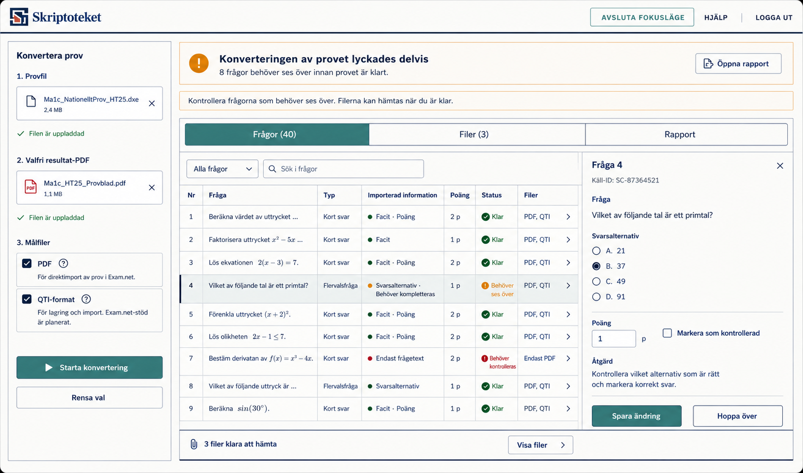

# ST-21-03 Exam Converter Authenticated Progressive Review

## Purpose

Retain the selected mockup direction for the authenticated Exam Converter
workspace before implementation continues under `PR-0325`.

This mockup is approved as a broad interpretation of Skriptoteket's
Klassrumskartan-derived design system: dense workspace, token-driven color,
hard structural lines, progressive disclosure, and teacher-facing Swedish copy.

## Preview

## Design Verdict

Accepted:

- overall visual alignment with Skriptoteket and Klassrumskartan;
- top application bar, canvas tone, deep navy structure, and verdigris primary
  action treatment;
- left workflow rail as the persistent input/action surface;
- compact result strip with a single headline and next-action sentence;
- segmented inspection modes (`Frågor`, `Filer`, `Rapport`) as the progressive
  discovery mechanism;
- question-review mode as the dominant active workspace;
- one selected question detail pane instead of multiple expanded details;
- dynamic imported-information indicators per question row;
- direct question-level completion controls in the detail pane.

Rejected:

- the bottom stretched reminder panel with a centered `Visa filer` affordance.
  It reads as a strange extra panel and weakens the selected-mode model.

Implementation must remove or redesign that bottom affordance. Acceptable
alternatives include:

- rely on the `Filer (3)` segmented mode alone;
- move a compact `3 filer klara` hint into the result strip or mode label;
- expose file availability through the `Filer` tab without any bottom panel.

Do not implement the centered bottom dropdown-like affordance.

## Layout Description

### App Shell

- Use the authenticated Skriptoteket shell with the brand on the left and
  compact actions on the right.
- Preserve the hard navy bottom rule and calm canvas background.
- Do not introduce a separate marketing-style header or hero region.

### Left Workflow Rail

The left rail is always visible and owns input/setup actions:

1. `Provfil`
   - selected file row;
   - status `Filen är uppladdad`.
2. `Valfri resultat-PDF`
   - selected file row;
   - status `Filen är uppladdad`.
3. `Målfiler`
   - checked `PDF`;
   - checked `QTI-format`;
   - compact helper text for each target.
4. Actions
   - primary `Starta konvertering`;
   - secondary `Rensa val`.

The rail must stay compact. Do not add a broad instructional help box in the
default state.

`Målfiler` is a preview/declaration of intended target formats, not the final
file save/download decision. Final file actions happen after review inside the
`Filer` inspection mode.

### Result Strip

The result strip is the only global result state in the main workspace:

- headline: `Konverteringen av provet lyckades delvis`;
- detail: `8 frågor behöver ses över innan provet är klart.`;
- primary contextual action: `Öppna rapport`;
- next-action line:
  `Kontrollera frågorna som behöver ses över. Filerna kan hämtas när du är klar.`

Do not duplicate this status in other panels.

### Inspection Modes

The main workspace uses a segmented control:

- `Frågor (40)`;
- `Filer (3)`;
- `Rapport`.

Only one mode renders at a time.

Default after a partial conversion should be `Frågor`, because the teacher's
next useful action is to review incomplete questions.

### Question Review Mode

The active `Frågor` mode has two subregions:

- a dense question list for scanning;
- one selected-question detail pane.

The list is the navigation surface. The detail pane is the correction surface.
Do not expand several question details inline.

Question list columns:

- `Nr`;
- `Fråga`;
- `Typ`;
- `Importerad information`;
- `Poäng`;
- `Status`;
- `Filer`.

Dynamic imported-information indicators may include:

- `Facit`;
- `Poäng`;
- `Svarsalternativ`;
- `Endast frågetext`;
- `Behöver kompletteras`.

These indicators must be data-backed and source-aware.

### Selected Question Detail

The detail pane shows only the currently selected question:

- question number;
- low-emphasis source id;
- full question text;
- imported alternatives or answer fields when safe;
- editable points;
- direct completion action such as `Markera som kontrollerad`;
- next-action copy;
- primary `Spara ändring`;
- secondary `Hoppa över`.

The detail pane is not a report viewer. It exists to let the teacher complete
question data directly so the next PDF or QTI export becomes more complete.

## Component Translation

Likely production components:

- `ExamConverterAuthenticatedView`
  - owns page composition and app-host integration.
- `ExamConverterWorkflowRail`
  - owns source/supporting-file selection, target choices, and submit/reset.
- `ExamConverterResultStrip`
  - owns one global conversion state and one next action.
- `ExamConverterInspectionTabs`
  - owns `Frågor`, `Filer`, and `Rapport` mode selection.
- `ExamConverterQuestionList`
  - owns the dense, collapsed question table.
- `ExamConverterQuestionDetailPane`
  - owns selected-question editing and review completion.
- `ExamConverterFilesList`
  - rendered only inside the active `Filer` mode.
- `ExamConverterReportPanel`
  - rendered only inside the active `Rapport` mode.

Keep transport, save/runtime calls, and parser types outside these presentation
components.

## Visual Rules

Use Skriptoteket tokens and Klassrumskartan workspace patterns:

- background: `bg-canvas`;
- panels: `bg-panel` and `bg-panel-muted`;
- structure: `border-navy`, `text-navy`;
- primary actions: `bg-action`, `text-button-primary-text`;
- warnings: `warning`;
- failures: `error` or `critical`;
- icons and symbols use semantic token colors: verdigris for interactive
  affordances, terracotta only as a warm accent, success green for confirmed
  states, and error/critical red only when the state requires it;
- hard 4px corners;
- hard token shadows only where the workspace pattern calls for them.

Do not use:

- Tailwind default palette colors;
- broad gradients;
- blurred shadows;
- rounded SaaS cards;
- decorative orbs or blobs;
- summary cards for question types or vanity metrics.

## Copy Boundaries

Visible UI copy must stay teacher-facing. Do not expose:

- `artefakt`;
- `manifest`;
- `bundle`;
- `runtime`;
- `Vault`;
- `grant`;
- `lease`;
- `pipeline`;
- `inloggad konvertering`.
